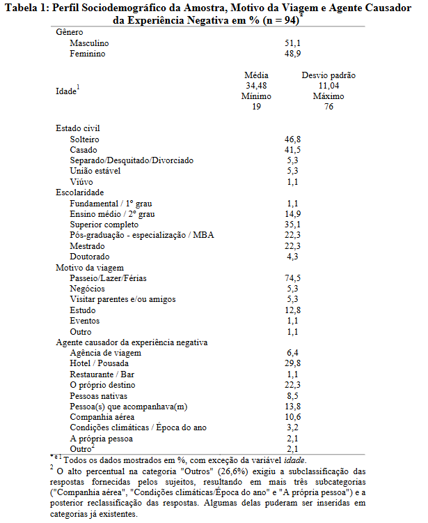

## 1.1 Introdução ao Negócio e Contexto

O setor de turismo é um complexo e dinâmico segmento da economia global, englobando todas as atividades relacionadas à viagem, hospedagem e lazer de indivíduos que se deslocam para fora do seu ambiente habitual. Mais do que uma simples movimentação de pessoas, o turismo é um poderoso motor econômico, responsável por impulsionar a geração de empregos, fomentar o comércio local e aumentar significativamente a arrecadação de receitas em destinos ao redor do mundo.
Nesse contexto, emerge a ideia de explorar a otimização da experiência turística e o bem-estar dos visitantes. Considerando que o turismo é a principal atividade econômica em várias cidades brasileiras, a concepção de uma ferramenta digital que possa oferecer orientação sobre atrativos locais e rotas personalizadas para esse público ganha relevância. O Touristeer atuaria nesse cenário exercendo um papel em alinhar a personalização e preferências dos usuários com os serviços de turismo oferecidos.

---

## 1.2 Identificação da Oportunidade ou Problema

Este projeto surge do contexto em que muitos viajantes se frustram com a rigidez dos serviços oferecidos ao não atenderem suas expectativas. Essa rigidez foi analisada, revelando causas que reforçam a passividade dos turistas diante de situações desagradáveis. Como resultado, a insatisfação e frustração tornam-se comuns, prejudicando a exploração das atividades disponíveis, evidenciando a importância de serviços mais personalizáveis.

> A figura abaixo apresenta um levantamento feito em 2023 contendo a faixa etária de preferências dos viajantes em relação ao uso de pacotes de viagens.

- **Ambiente externo**: normas e regulamentações no setor de turismo restringem a adaptação às preferências individuais, enquanto mercados tradicionais continuam a priorizar pacotes fixos e inflexíveis.
- **Métricas inadequadas**: há uma falta de indicadores que acompanhem a demanda por personalização e controle limitado sobre alterações em roteiros.
- **Materiais utilizados**: o uso de guias turísticos impressos com informações fixas e frequentemente desatualizadas, além de uma integração insuficiente com bases de dados dinâmicas.
- **Métodos e processos de trabalho**: problemas como a centralização dos planejamentos e reservas seguem estruturas padronizadas com pouca margem para alterações.
- **Operadores de turismo**: foco excessivo em pacotes tradicionais e falta de treinamento adequado para adaptar roteiros às preferências dos turistas.
- **Infraestrutura tecnológica**: ainda é insuficiente para oferecer ferramentas que possibilitem personalização em tempo real. A ausência de aplicativos intuitivos e plataformas dinâmicas dificulta o planejamento e a execução de roteiros personalizados.

Esse conjunto de fatores reforça a passividade dos turistas, que frequentemente se veem presos a roteiros pré-estabelecidos e com pouca liberdade para planejar ou explorar suas viagens de acordo com seus próprios interesses. Como resultado, a insatisfação e a frustração tornam-se comuns, prejudicando o aproveitamento pleno das experiências de viagem e evidenciando a necessidade de soluções mais flexíveis e personalizáveis.

---

> A figura, a seguir, apresenta o diagrama de Ishikawa contendo as causas (organizadas pelos 6M’s) e o problema do cliente.

## 1.3 Desafios do Projeto

### Desafio de Integrar Fontes Locais de Turismo

Informações sobre pontos turísticos, eventos e atrações culturais estão dispersas entre sites municipais, blogs, redes sociais e plataformas desatualizadas. A ausência de uma base centralizada e confiável compromete a oferta de dados em tempo real dentro do aplicativo. Essa fragmentação dificulta a entrega de sugestões precisas ao usuário, afetando negativamente sua experiência e a confiança no serviço.

### Dificuldade em Criar Rotas Turísticas Relevantes e Personalizadas

Ao contrário de aplicativos tradicionais de navegação, que priorizam rotas rápidas, o **Touristeer** precisa considerar múltiplos fatores, como interesse turístico dos pontos, avaliações de usuários, acessibilidade e tempo disponível. O desafio está em transformar essas variáveis em rotas otimizadas e culturalmente sensíveis, exigindo um alto grau de inteligência contextual e técnica.

### Competição com Grandes Aplicativos de Navegação

O **Touristeer** será lançado em um cenário dominado por plataformas consolidadas como **Google Maps** e **Waze**, amplamente utilizadas também por turistas. O desafio está em se diferenciar não como mais uma ferramenta de navegação, mas como uma solução voltada exclusivamente para turismo inteligente. Isso exige foco em roteiros curtos, integração com a cultura local e economia de tempo e recursos para o usuário.

---

## 1.4 Segmentação de Clientes

A análise do comportamento dos viajantes revela que uma parcela significativa dos entrevistados que optam por serviços de agências de viagem (24,9% do total) pertence a faixas etárias mais experientes. Especificamente, observa-se uma maior adesão a esses serviços tradicionais entre os grupos de 45 a 59 anos (33,9%) e aqueles com 60 anos ou mais (19,3%), indicando uma preferência por intermediários convencionais.

> A figura abaixo apresenta um levantamento feito em 2023 contendo a faixa etária de preferências dos viajantes em relação ao uso de pacotes de viagens.

Nesse contexto de mercado, o **Touristeer**, direciona sua estratégia para uma faixa etária complementar: os jovens adultos, que compreendem o público de 16 a 44 anos. Esta segmentação é justificada pela percepção de que esses grupos demográficos (16-24 anos com 11,0%, 25-34 anos com 18,3% e 35-44 anos com 17,4% de uso de agências) demonstram uma menor dependência dos serviços convencionais de agências de viagem. Essa característica indica um potencial significativo para soluções digitais que ofereçam autonomia e personalização na exploração de destinos.

??? abstract "Histórico de Versão"
    | Data | Versão | Descrição | Autor | Revisores|
    |-|-|-|-|-|
    |07/04/2025| 1.0 | Definição do produto e projeto | Todos os integrantes do grupo |Todos os integrantes da equipe|
    |09/04/2025| 1.2 | Reescrita do tópico 1.2 | Rodrigo Amaral |Todos os integrantes da equipe|
    |20/04/2025| 1.3 | Reescrita dos tópico 1.1 e 1.2 | Samuel Afonso |Gabriel Soares|
    |21/04/2025| 1.4 | Reescrita dos tópico 1.3 e 1.4 | Gabriel Soares |Leonardo Sauma|
    |21/04/2025| 1.4 | Alteração no tópico 1.1 | Rodrigo Amaral |Leonardo Sauma|
    |26/05/2025| 1.5 | Alteração nos tópicso 1.1, 1.2 e 1.4 | Rodrigo Amaral |Samuel Afonso|