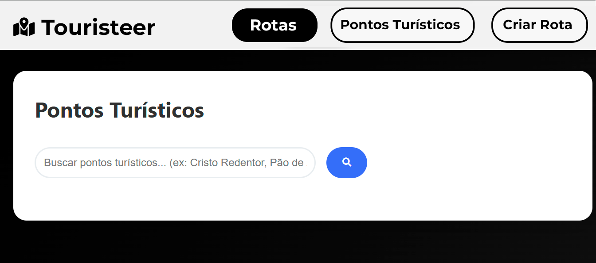

# Protótipos Desenvolvidos

A equipe desenvolvou protótipos da aplicação utilizando a plataforma Figma. Foram desenvolvidos dois protótipos de alta fidelidade e um de baixa fidelidade, os protótipos foram validados com o cliente, que optou pela segunda variação para a equipe desenvolver o projeto em cima.

## Protótipo Alta Fidelidade [1.0] 

### Home

### Mapa 1

### Mapa 2

### Criar Rotas

### Rotas

## Protótipo Alta Fidelidade [2.0] 

## Protótipo Baixa Fidelidade [1.0]

