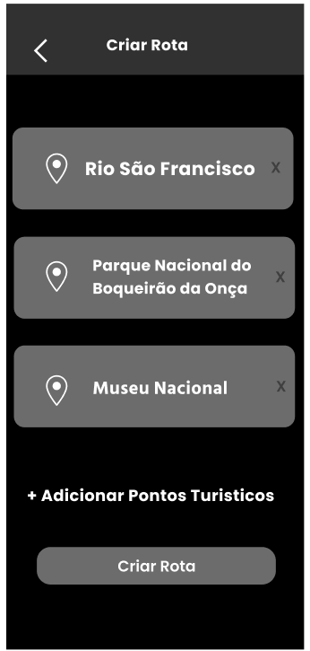
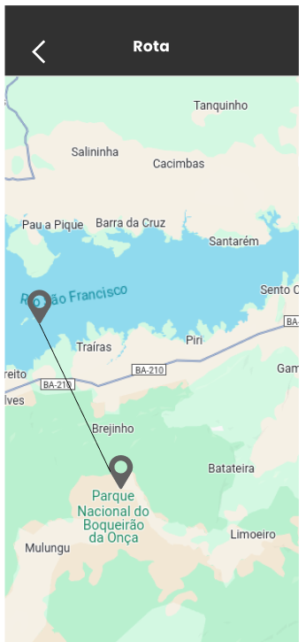

# Protótipos Desenvolvidos

A equipe desenvolvou protótipos da aplicação utilizando a plataforma figma. Foram desenvolvidos dois protótipos, um focado na aplicação voltada a smartphones, outro para telas de computadores e notebooks.

## Protótipo 1 - Smartphone

### Home

### Mapa 1

### Mapa 2

### Criar Rotas

### Rotas

