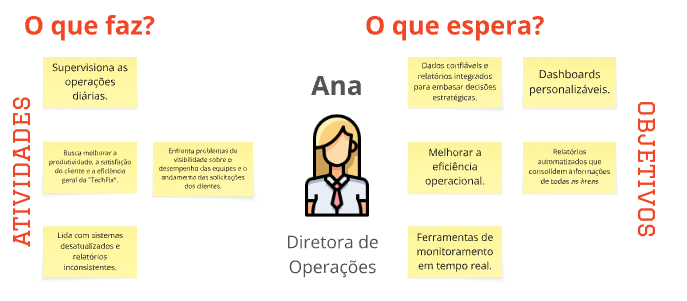

# PBB

## Contexto TechFix

A TechFix é uma empresa consolidada que oferece suporte técnico e manutenção de equipamentos para clientes corporativos e residenciais. Apesar de sua experiência, a empresa enfrenta problemas operacionais que ameaçam sua eficiência e reputação, como atrasos nos atendimentos, falta de previsibilidade e falhas de comunicação que resultam em agendamentos duplicados ou cancelamentos.

## Desafios

O estudo de caso aponta desafios significativos que a TechFix pretende superar:

- Comunicação e Agendamento: Os clientes recebem informações conflitantes sobre a disponibilidade dos técnicos, e a falta de um sistema integrado causa conflitos de agenda e atrasos. Clientes corporativos enfrentam demoras na entrega de peças e dificuldades no rastreamento de suas solicitações.

- Processos Internos e Padronização: Os técnicos não possuem ferramentas adequadas para registrar os serviços, utilizando anotações manuais que levam à perda de dados críticos e à fragmentação do histórico de atendimentos. A digitação posterior desses registros gera retrabalho e risco de erros.

- Coleta e Análise de Feedback: A coleta de feedback dos clientes é ineficaz, realizada por meio de questionários manuais com baixa taxa de resposta, o que dificulta a implementação de melhorias.

- Gestão e Visibilidade Operacional: A falta de integração entre os sistemas internos gera retrabalho e relatórios inconsistentes, dificultando o monitoramento do desempenho da equipe e a tomada de decisões estratégicas pelos gestores.

## Soluções

A solução para a TechFix foi concebida considerando as necessidades e expectativas de diferentes personas:

- Para Carlos, o Técnico de Campo: A solução deve incluir um sistema móvel para registrar serviços em tempo real, com acesso ao histórico detalhado dos equipamentos e guias técnicos para agilizar o diagnóstico e evitar redundâncias.

- Para Mariana, a Atendente: A plataforma deve oferecer ferramentas para facilitar o agendamento, com uma visualização centralizada da agenda e sistemas automatizados para notificações, a fim de reduzir o retrabalho e melhorar a comunicação com o cliente.

- Para Rafael, o Cliente Corporativo: A proposta inclui um portal para acompanhamento das solicitações em tempo real, com notificações automáticas e relatórios detalhados sobre as intervenções, garantindo agilidade e transparência.

- Para Ana, a Diretora de Operações: A solução precisa fornecer dados confiáveis por meio de dashboards personalizáveis e relatórios automatizados para monitorar o desempenho em tempo real e embasar decisões estratégicas.

<iframe width="100%" height="600" src="https://miro.com/app/board/uXjVInrC7Q0=/" frameborder="0" scrolling="no" allow="fullscreen; clipboard-read; clipboard-write" allowfullscreen></iframe>

## Descrição PBB

## Persona 01: Técnico de Campo

### O que faz? (Atividades)

- **Realiza manutenções e reparos em equipamentos**
- **Visita 6 clientes por dia**
- **Registra serviços em papel/apps não integrados**

### O que espera? (Objetivos)

- **Sistema movel para registro em tempo real**
- **Acesso a histórico e guias técnicas**
- **Suporte técnico centralizado**
- **Integração com o sistema central**
---

## Persona 02: Atendente

### O que faz? (Atividades)

- **Atende às solicitações dos clientes**
- **Organiza atendimentos**
- **Tenta conciliar com a disponibilidade dos técnicos**
- **Lida com frustração dos clientes devido a atrasos/inconsistências **

### O que espera? (Objetivos)

- **Ferramentas que facilitem o agendamento**
- **Visualização centralizada da agenda**
- **Ferramentas que facilitem a gestão de informações dos clientes**
- **Sisitemas automatizados para notificações**
- **Reduzir trabalho**
- **Integração com o histórico de serciços para respostas ágeis **
 ---

## Persona 03: Diretora de operações

### O que faz? (Atividades)

- **Supervisiona as operações diárias**
- **Busca melhorar a produtividade, satisfação do cliente e a eficiência geral**
- **Lida com sistemas desatualizados e relatórios inconsistentes**
- **Enfrenta problemas de visibilidade sobre o desempenho das equipes e o andamento das solicitações dos clientes**

### O que espera? (Objetivos)

- **Dados confiaveis e relatótios intergrados para embasar decisões estratégicas**
- **Dashboards personalizáveis**
- **Melhorar eficiência operacional**
- **Ferramentas de monitoramento em tempo real**
- **Relatórios automatizados que consolidam informações de todas as áreas **
 ---

## Persona 04: Cliente corporativo

### O que faz? (Atividades)

- **Garante sistemas de TI operacionais**
- **Solicita reparos, manutenção, atualizações e suporte emergencial**
- **Pede auditorias regulares**

### O que espera? (Objetivos)

- **Serviços ráoidos e confiáveis**
- **Relatórios detalhados pós-intervenção**
- **Respostas de emergências (2h) , resolução crítica (24h)**
- **Aviso prévio (48h) e plano para manutenções**
- **Portal de acompanhamento e feedback automatizado **
-  **Transparência e notficações em tempo real **
 ---

# Cenários de BDD

### Visualizar a disponibilidade em tempo real dos técnicos no sistema de agendamento

## História de usuário:
"Como um Atendente, eu quero visualizar em tempo real a disponibilidade dos técnicos, para agendar serviços de forma eficiente."

## Cenário 01: Atendente visualiza disponibilidade para novo agendamento
**Dado** que sou um atendente e estou logado no sistema de agendamento.

**E** existem técnicos com diferentes especialidades e agendas no sistema.

**Quando** eu busco por um técnico para um novo serviço específico (data, hora, especialidade).

**Então** devo visualizar a disponibilidade dos técnicos em tempo real.

**E** devo conseguir selecionar um horário disponível para o agendamento.

## Cenário 02: Atendente visualiza indisponibilidade de técnico
**Dado** que sou um atendente e estou logado no sistema de agendamento.

**E** um técnico específico está marcado como indisponível em um determinado período.

**Quando** eu busco por esse técnico para um agendamento nesse período.

**Então** o sistema deve me informar que o técnico está indisponível.

**E** deve sugerir alternativas ou períodos disponíveis para o mesmo técnico ou outros.

---
## Conciliar automaticamente a disponibilidade dos técnicos com os pedidos de serviço no sistema de agendamento.

## História de usuário:
"Como um Atendente, eu quero ter um sistema que concilie automaticamente a disponibilidade dos técnicos com os pedidos de serviço, para reduzir conflitos de agenda."

## Cenário 01: Sistema concilia automaticamente disponibilidade e pedidos com sucesso
**Dado** que um novo pedido de serviço foi registrado com data, hora e especialidade solicitadas.

**E** existem técnicos com disponibilidade e especialidade correspondente.

**Quando** o sistema tenta atribuir o serviço a um técnico.

**Então** o sistema deve sugerir automaticamente técnicos compatíveis e disponíveis.

**E** deve permitir que eu confirme a atribuição sem conflitos.

## Cenário 02: Sistema alerta sobre impossibilidade de conciliação imediata

**Dado** que um novo pedido de serviço foi registrado com data, hora e especialidade solicitadas.

**E** não há técnicos disponíveis ou com a especialidade necessária para o período solicitado.

**Quando** o sistema tenta atribuir o serviço a um técnico.

**Então** o sistema deve me alertar sobre a impossibilidade de conciliação imediata.

**E** deve sugerir que eu revise as opções de horário ou busque por outros técnicos.

---
## Assegurar que o técnico agendado possui a especialidade necessária na solicitação de serviço

## História de usuário:
"Como um Cliente Corporativo, eu quero ter a certeza de que o técnico agendado possui a especialidade necessária para meu problema, para garantir a resolução eficiente"

## Cenário 01: Cliente verifica especialidade do técnico na confirmação do agendamento

**Dado** que sou um cliente corporativo e solicitei um serviço de "Manutenção de Servidores".

**E** recebi a confirmação do agendamento por e-mail ou via portal.

**Quando** eu consulto os detalhes do agendamento no portal do cliente.

**Então** devo visualizar o nome do técnico e sua especialidade principal, como "Especialista em Redes e Servidores".

**E** a especialidade deve ser claramente compatível com o serviço solicitado.

## Cenário 02: Cliente percebe inconsistência na especialidade do técnico

**Dado** que sou um cliente corporativo e solicitei um serviço de "Reparo de Impressoras Industriais".

**E** recebi a confirmação do agendamento com os dados do técnico.

**Quando** eu consulto os detalhes do agendamento e vejo que a especialidade do técnico é "Automação Residencial".

**Então** devo ter uma opção clara para entrar em contato com a TechFix para questionar a atribuição.

**E** devo poder solicitar a substituição por um técnico com a especialidade correta.

---
## Informar a disponibilidade em tempo real do técnico no aplicativo móvel.

## História de usuário:
"Como um Técnico de Campo, eu quero informar minha disponibilidade em tempo real, para evitar agendamentos conflitantes."

## Cenário 01: Técnico atualiza sua disponibilidade para um período específico

**Dado** que sou um técnico de campo e estou usando o aplicativo móvel.

**E** tive um imprevisto que me deixará indisponível por 2 horas na parte da tarde.

**Quando** eu acesso a função "Atualizar Disponibilidade" no aplicativo e marco meu status como indisponível para o período.

**Então** minha agenda no sistema de agendamento deve ser bloqueada para esse período.

**E** o atendente não deve conseguir me atribuir novos serviços nesse intervalo.

## Cenário 02: Técnico finaliza serviço antes do previsto e se torna disponível

**Dado** que sou um técnico de campo e estou usando o aplicativo móvel.

**E** fui agendado para um serviço que estimava 3 horas, mas terminei em 1 hora.

**Quando** eu marco o serviço como "Concluído" no aplicativo antes do tempo previsto.

**Então** minha disponibilidade restante para o dia deve ser atualizada no sistema de agendamento.

**E** o atendente deve conseguir me visualizar como disponível para novos agendamentos se houver tempo hábil.

---

## Monitorar a conformidade dos agendamentos com as especialidades dos técnicos no dashboard de gestão

## História de usuário:
"Como uma Diretora de Operações, eu quero monitorar a conformidade dos agendamentos com as especialidades dos técnicos, para garantir a eficiência da equipe."

## Cenário 01: Diretora identifica alta conformidade na atribuição de especialidades

**Dado** que sou a Diretora de Operações e acesso o dashboard de gestão.

**E** o sistema de agendamento está funcionando conforme o esperado.

**Quando** eu visualizo o relatório de conformidade de agendamentos por especialidade nos últimos 30 dias.

**Então** devo ver que mais de 95% dos serviços foram atribuídos a técnicos com a especialidade requerida.

**E** devo conseguir exportar esse relatório para análise.

## Cenário 02: Diretora identifica baixa conformidade e busca detalhes

**Dado**  que sou a Diretora de Operações e acesso o dashboard de gestão.

**E** o relatório de conformidade de agendamentos por especialidade indica um baixo índice (ex: 70%).

**Quando** eu clico no índice de baixa conformidade para ver os detalhes.

**Então** devo visualizar a lista de agendamentos onde a especialidade do técnico não correspondia à exigida pelo serviço.

**E** devo conseguir identificar os motivos ou os atendentes responsáveis por essas atribuições.

---
## Acessar um portal online para acompanhar o status em tempo real das solicitações o cliente corporativo

## História de usuário:
" Como um Cliente Corporativo, eu quero acessar um portal online, para acompanhar o status em tempo real das minhas solicitações."

## Cenário 01: Cliente corporativo acessa o portal e vê o status de uma solicitação em andamento

 que sou um cliente corporativo e tenho credenciais válidas para o portal do cliente.

**E** tenho uma solicitação de serviço (ex: reparo de servidor) em andamento.

**Quando** eu faço login no portal.

**Então** devo visualizar uma lista das minhas solicitações ativas.

**E** para a solicitação em questão, devo ver o status atual (ex: "Em Atendimento", "Aguardando Peça", "Concluído") em tempo real.

## Cenário 02: Cliente corporativo acessa o portal e vê o status de uma solicitação concluída

**Dado** que sou um cliente corporativo e tenho credenciais válidas para o portal do cliente.

**E** tenho uma solicitação de serviço que foi concluída.

**Quando** eu faço login no portal e acesso minhas solicitações.

**Então** devo visualizar a solicitação com o status "Concluído".

**E** devo conseguir acessar o relatório detalhado da intervenção.

---

## Solicitar serviços diretamente pelo portal o cliente corporativo.

## História de usuário:
" Como um Cliente Corporativo, eu quero solicitar serviços diretamente pelo portal, para agilizar o processo."

## Cenário 01: Cliente corporativo solicita um novo serviço padrão pelo portal

**Dado** que sou um cliente corporativo e estou logado no portal do cliente.

**E** preciso solicitar um novo serviço (ex: manutenção de rede corporativa).

**Quando** eu clico na opção "Solicitar Novo Serviço" e preencho o formulário com os detalhes necessários.

**Então** a solicitação deve ser registrada com sucesso no sistema da TechFix.

**E** devo receber uma confirmação imediata da solicitação via portal e e-mail.

## Cenário 02: Cliente corporativo solicita um serviço emergencial pelo portal

**Dado** que sou um cliente corporativo e estou logado no portal do cliente.

**E** estou enfrentando uma interrupção em atividade crítica que demanda suporte técnico emergencial.

**Quando** eu seleciono a opção de serviço "Emergencial" no formulário de solicitação e envio.

**Então** a solicitação deve ser marcada como de alta prioridade.

**E** devo receber uma confirmação de que a solicitação está sendo processada com urgência, conforme o SLA.

---

## Visualizar o histórico de serviços e relatórios detalhados no portal do cliente

## História de usuário:
"Como um Cliente Corporativo, eu quero visualizar meu histórico de serviços e relatórios detalhados, para planejamento futuro e auditoria."

## Cenário 01: Cliente corporativo acessa histórico completo de serviços

**Dado** que sou um cliente corporativo e estou logado no portal do cliente.

**Quando** eu acesso a seção "Histórico de Serviços".

**Então** devo visualizar uma lista completa de todos os serviços prestados pela TechFix para minha empresa.

**E** devo poder filtrar ou buscar por serviços específicos (ex: por data, tipo de serviço, equipamento).

## Cenário 02: Cliente corporativo baixa relatório detalhado de uma intervenção

**Dado**  que sou um cliente corporativo e estou visualizando meu histórico de serviços no portal.

**E** um serviço específico foi concluído e tem um relatório associado.

**Quando** eu clico no serviço concluído e seleciono a opção "Visualizar Relatório Detalhado".

**Então**  devo ser capaz de visualizar e baixar um relatório detalhado da intervenção realizada, incluindo ações, peças e tempo.

**E** o relatório deve estar em um formato adequado para registro e planejamento (ex: PDF).

---

## Direcionar clientes para o autoatendimento de status no portal do cliente

## História de usuário:
" Como um Atendente, eu quero direcionar os clientes para o portal para autoatendimento de status, para reduzir o volume de chamadas."

## Cenário 01: Atendente informa cliente sobre funcionalidade de autoatendimento do portal

**Dado** que sou um atendente e recebo uma chamada de um cliente perguntando sobre o status de uma solicitação.

**E** o cliente já possui acesso ao portal ou pode ser rapidamente cadastrado.

**Quando** eu informo o cliente que ele pode acompanhar o status em tempo real pelo portal.

**Então** o cliente deve ser capaz de acessar o portal e encontrar a informação por si mesmo.

**E** a ligação deve ser concluída mais rapidamente, sem a necessidade de eu buscar manualmente o status.

## Cenário 02: Atendente verifica que o cliente usou o portal para autoatendimento

**Dado** que sou um atendente e um cliente me liga para perguntar sobre o status de um serviço.

**E** eu vejo no sistema que o cliente acessou o portal recentemente e consultou o status desse mesmo serviço.

**Quando** eu pergunto ao cliente se ele já verificou o portal.

**Então** o cliente deve confirmar que sim, e eu posso oferecer ajuda adicional se necessário, ou encerrar a chamada.

**E** isso indica que o portal está sendo eficaz na redução de chamadas de status.

---

## Monitorar a utilização do portal pelo cliente através de relatórios do portal

## História de usuário:
"Como uma Diretora de Operações, eu quero monitorar a utilização do portal pelo cliente, para avaliar a satisfação e engajamento."

## Cenário 01: Diretora visualiza o número de acessos e usuários ativos do portal

**Dado** que sou a Diretora de Operações e acesso o dashboard de gerenciamento.

**Quando** eu seleciono as métricas de uso do portal do cliente.

**Então** devo visualizar o número total de acessos ao portal por período (diário, semanal, mensal).

**E** devo ver o número de usuários únicos ativos no portal.

## Cenário 02: Diretora analisa as funcionalidades mais utilizadas no portal

**Dado** que sou a Diretora de Operações e estou monitorando o uso do portal.

**Quando** eu acesso o relatório de funcionalidades mais utilizadas no portal.

**Então** devo identificar quais seções (ex: "Acompanhar Solicitações", "Histórico de Serviços", "Solicitar Novo Serviço") são mais acessadas pelos clientes.

**E** essa informação deve me ajudar a priorizar futuras melhorias no portal.