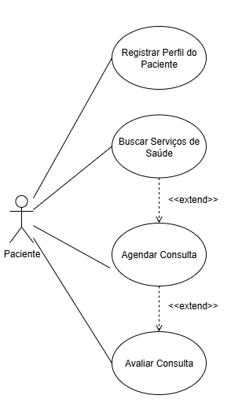
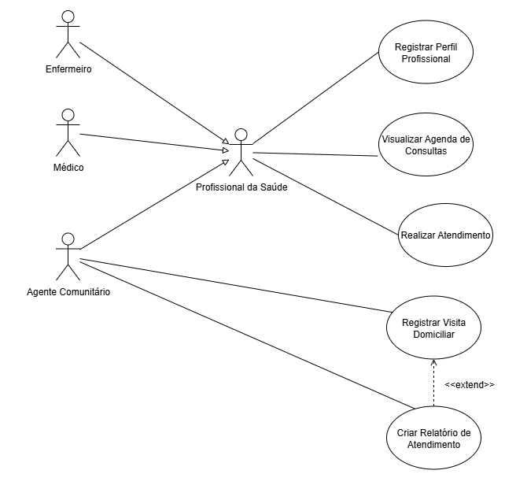
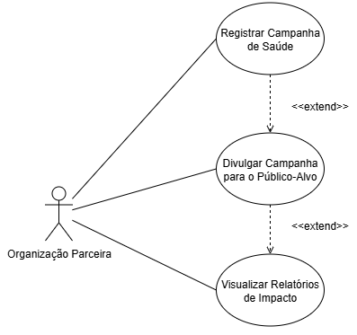
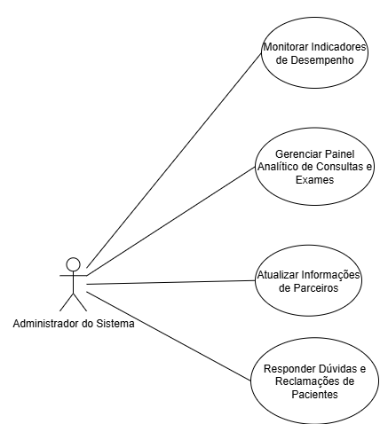

# UC

## 1. Contexto do Projeto

O projeto "ConnectCare" foi concebido para atender a comunidades remotas com acesso limitado a serviços de saúde, como a Vila Esperança. A plataforma foi projetada para superar barreiras como a falta de transporte e informações, facilitando o acesso dos moradores a cuidados médicos de forma eficiente e acessível.

**Missão Principal:** Garantir que comunidades vulneráveis tenham acesso facilitado e eficiente a serviços de saúde, promovendo bem-estar social e impacto positivo por meio da tecnologia.

**Objetivos Específicos:**

- Expandir o acesso aos serviços de saúde, permitindo que pacientes localizem e agendem consultas com facilidade.
- Automatizar processos de atendimento, como agendamento online e gerenciamento de prontuários.
- Promover campanhas de saúde comunitária, como vacinação e palestras educacionais.
- Monitorar o impacto social e operacional através de ferramentas analíticas.

## 2. Atores do Sistema

- **Paciente:** Público principal, utiliza a plataforma para acessar serviços de saúde.
- **Profissional de Saúde:** Médicos e enfermeiros que gerenciam atendimentos e prontuários.
- **Agente Comunitário:** Realiza visitas domiciliares e coleta dados de saúde da comunidade.
- **Organização Parceira:** ONGs, hospitais e instituições que divulgam e gerenciam iniciativas de saúde.
- **Administrador do Sistema:** Responsável pela manutenção, monitoramento e gerenciamento da plataforma.

## 3. Índice de Casos de Uso

### 3.1 Paciente

- [UC01: Registrar Perfil do Paciente](#uc01-registrar-perfil-do-paciente)
- [UC02: Buscar Serviços de Saúde](#uc02-buscar-serviços-de-saúde)
- [UC03: Agendar Consulta](#uc03-agendar-consulta)
- [UC06: Avaliar Consulta](#uc06-avaliar-consulta)

### 3.2 Profissional de Saúde

- [UC07: Registrar Perfil Profissional](#uc07-registrar-perfil-profissional)
- [UC08: Visualizar Agenda de Consultas](#uc08-visualizar-agenda-de-consultas)
- [UC09: Realizar Atendimento](#uc09-realizar-atendimento)

### 3.3 Agente Comunitário

- [UC10: Registrar Visita Domiciliar](#uc10-registrar-visita-domiciliar)
- [UC11: Criar Relatório de Atendimento](#uc11-criar-relatório-de-atendimento)

### 3.4 Organização Parceira

- [UC12: Registrar Campanha de Saúde](#uc12-registrar-campanha-de-saúde)
- [UC14: Divulgar Campanha para Público-Alvo](#uc14-divulgar-campanha-para-público-alvo)
- [UC15: Visualizar Relatórios de Impacto](#uc15-visualizar-relatórios-de-impacto)

### 3.5 Administrador do Sistema

- [UC16: Monitorar Indicadores de Desempenho](#uc16-monitorar-indicadores-de-desempenho)
- [UC17: Gerenciar Painel Analítico de Consultas e Exames](#uc17-gerenciar-painel-analítico-de-consultas-e-exames)
- [UC18: Atualizar Informações de Parceiros](#uc18-atualizar-informações-de-parceiros)
- [UC19: Responder Dúvidas e Reclamações de Pacientes](#uc19-responder-dúvidas-e-reclamações-de-pacientes)

## 4. Especificação dos Casos de Uso

---

### UC01: Registrar Perfil do Paciente

#### **1. Breve Descrição**

Este caso de uso permite que um novo **Paciente** crie seu perfil básico na plataforma ConnectCare. O registro é o primeiro passo para que o usuário possa acessar os demais serviços do sistema, como a busca e o agendamento de consulta.

#### **2. Atores**

- **Primário:** Paciente

#### **3. Fluxo Principal de Eventos**

Este caso de uso é iniciado quando um novo usuário seleciona a opção para se registrar na plataforma.

- **3.1.** O sistema apresenta ao **Paciente** um formulário de registro.
- **3.2.** O **Paciente** preenche as informações solicitadas no formulário. **[RN01]**
- **3.3.** O **Paciente** submete o formulário para criar seu perfil.
- **3.4.** O sistema valida as informações preenchidas. **[RN01] [FE01]**
- **3.5.** O sistema cria um novo perfil de paciente, armazenando as informações de forma segura. **[RE01] [FE02]**
- **3.6.** O sistema exibe uma mensagem confirmando que o registro foi realizado com sucesso.
- **3.7.** O caso de uso é encerrado.

#### **4. Fluxos Alternativos**

- Nenhum fluxo alternativo foi identificado para esta versão do caso de uso.

#### **5. Fluxos de Exceção**

- **[FE01] Validação de Informações**
    - No passo 3.4 do Fluxo Principal, se o sistema detectar que uma ou mais informações do formulário são inválidas (ex: campo obrigatório em branco, formato incorreto), ele exibirá uma mensagem de erro indicando os campos a serem corrigidos. O fluxo retorna ao passo 3.2 para que o **Paciente** possa revisar e corrigir os dados.
- **[FE02] Falha na Criação do Perfil**
    - No passo 3.5 do Fluxo Principal, se ocorrer um erro técnico que impeça o sistema de salvar o novo perfil (ex: falha no banco de dados), o sistema deverá exibir uma mensagem de erro ao usuário, informando sobre a instabilidade e sugerindo que tente novamente mais tarde. O erro técnico deve ser registrado para análise do administrador. O fluxo retorna para o passo 3.7.

#### **6. Requisitos Especiais**

- **[RE01] Segurança da Informação:** OO sistema deve garantir a segurança das informações armazenadas, estando em conformidade com as regulamentações de proteção de dados, para promover um ambiente seguro e confiável.
- **[RE02] usabilidade:** OA interface de registro deve ser simples e projetada para funcionar em dispositivos com capacidades limitadas.

#### **7. Regras de Negócio**

- **[RN01] Campos de Registro:** As informações que o formulário de registro devem constar são as seguintes:

| Nome do Campo | Formato | Obrigatoriedade |
|----------------|---------|-----------------|
| Nome do Paciente | Texto | Sim |
| Idade | Número Inteiro | Sim |
| Condições de Saúde/Alergias | Texto | Sim |

- **[RN02] Notificações Pré-Consulta:** Antes da data da consulta, o sistema deve enviar notificações ao paciente com lembretes e informações relevantes, como a necessidade de levar documentos de identificação e o uso de máscara no local.

#### **8. Pré-Condições**

- O usuário que inicia este caso de uso não deve possuir um cadastro prévio ou estar autenticado no sistema.

#### **9. Pós-Condições**

- **[PCO01] Perfil do Paciente Criado:** Um novo registro de paciente existe no banco de dados do sistema.
- **[PCO02] Paciente Autenticado:** Ao final do processo, o paciente está logado na plataforma e pode acessar outras funcionalidades.

#### **10. Pontos de Extensão**

- Nenhum ponto de extensão foi identificado para esta versão do caso de uso.

---

### UC02: Buscar Serviços de Saúde

#### **1. Breve Descrição**

Este caso de uso permite que o **Paciente** localize serviços de saúde essenciais na plataforma. O sistema pode mapear e listar clínicas, hospitais e campanhas de saúde próximas, facilitando o acesso do usuário aos cuidados médicos.

#### **2. Atores**

- **Primário:** Paciente

#### **3. Fluxo Principal de Eventos**

Este caso de uso é iniciado quando o **Paciente**, já logado, seleciona a opção para buscar serviços de saúde.

* **3.1.** O sistema apresenta uma interface de busca.  
* **3.2.** O **Paciente** utiliza os filtros para refinar sua busca, podendo informar critérios como localização, tipo de atendimento e disponibilidade. **\[FA01\]**  
* **3.3.** O **Paciente** aciona o comando para realizar a busca.  
* **3.4.** O sistema processa os critérios e exibe uma lista de serviços de saúde, como a unidade mais próxima com os horários disponíveis. **\[FE01\]**  
* **3.5.** O **Paciente** seleciona um serviço da lista para visualizar mais detalhes.  
* **3.6.** O caso de uso é encerrado, podendo ser estendido. **\[PE01\]**

#### **4. Fluxos Alternativos**

- **\[FA01\] Indicação de Falta de Transporte**
    - No passo 3.2, caso o paciente indique que não possui acesso a transporte, o sistema pode incluir nos resultados da busca campanhas móveis de atendimento ou agentes comunitários disponíveis para visitas domiciliares. 

#### **5. Fluxos de Exceção**

* **\[FE01\] Nenhum Serviço Encontrado**  
    * No passo 3.4, se a busca não encontrar nenhum serviço que corresponda aos filtros informados, o sistema exibirá uma mensagem informativa. O fluxo retorna ao passo 3.2 para que o **Paciente** possa alterar os critérios da busca.

#### **6. Requisitos Especiais**

* **\[RE01\] Integração com Mapa:** O sistema deve ser capaz de exibir os resultados em um mapa simplificado, que pode ser acessado offline para ajudar o paciente a encontrar a unidade de saúde. 

#### **8\. Pré-Condições**

* O **Paciente** deve estar logado na plataforma. 

#### **9\. Pós-Condições**

* **\[PCO01\] Informação Obtida:** O **Paciente** visualizou uma lista de serviços de saúde que atendem aos seus critérios de busca.

#### **10\. Pontos de Extensão**

* **\[PE01\] Estender o Caso de Uso: Agendar Consulta**  
    * **Local:** No passo 3.6, após o paciente visualizar os detalhes de um serviço de saúde.  
    * **Condição:** O sistema deve oferecer a opção de iniciar o caso de uso **"Agendar Consulta"** para que o paciente possa marcar um horário no serviço selecionado.

---

### UC03: Agendar Consulta

#### **1\. Breve Descrição**

Este caso de uso permite que o ator **Paciente** agende consultas (online ou presenciais) de forma simples e rápida através da plataforma ConnectCare. Para isso, o paciente primeiro busca por serviços de saúde disponíveis e depois seleciona um horário para o agendamento.

#### **2\. Atores**

* **Primário:** Paciente

#### **3\. Fluxo Principal de Eventos** 

Este caso de uso é iniciado quando o **Paciente**, já logado, seleciona a opção para agendar uma nova consulta.

* **3.1.** O sistema apresenta um menu com os tipos de serviços de saúde ou especialidades disponíveis (ex: Clínica Geral, Pediatria, Campanhas de Vacinação). **\[RN01\]**  
* **3.2.** O Paciente seleciona o serviço desejado no menu.  
* **3.3.** O sistema exibe uma lista de unidades de saúde e/ou profissionais que oferecem o serviço selecionado, juntamente com os horários disponíveis. **\[FE01\] \[FA01\]**  
* **3.4.** O Paciente seleciona a unidade e o horário desejado e solicita o agendamento.  
* **3.5.** O sistema salva a consulta, associa ao histórico do Paciente e exibe uma mensagem de confirmação com detalhes do agendamento (local, data, horário). **\[FE02\]**  
* **3.6.** O sistema programa o envio de notificações futuras com informações relevantes sobre a consulta. **\[RN02\]**  
* **3.7.** O caso de uso é encerrado. **\[PE01\]**

#### **4\. Fluxos Alternativos**

* **\[FA01\] Paciente com dificuldade de transporte**  
    * Durante a execução do passo 3.3, caso o **Paciente** indique dificuldade de transporte, o sistema, além dos resultados padrão, pode indicar campanhas móveis de atendimento ou a disponibilidade de agentes comunitários para visitas domiciliares. O fluxo então retorna ao passo 3.3, com a lista de opções ajustada.

#### **5\. Fluxos de Exceção**

* **\[FE01\] Nenhum serviço encontrado**  
    * No passo 3.3 do Fluxo Principal, se para o serviço selecionado não houver nenhum horário disponível, o sistema exibirá uma mensagem informativa. O fluxo retorna ao passo 3.1 para que o **Paciente** possa selecionar outro serviço.  
* **\[FE02\] Falha ao Salvar Agendamento**  
    * No passo 3.5 do Fluxo Principal, se ocorrer um erro técnico que impeça o sistema de salvar a consulta (ex: falha no banco de dados), o sistema deverá exibir uma mensagem de erro ao paciente, informando sobre a instabilidade e solicitando que tente novamente. O erro técnico deve ser registrado para análise do administrador. O fluxo retoma ao 3.7

#### **6\. Requisitos Especiais**

* **\[RE01\] Usabilidade e Desempenho:** O aplicativo deve ser projetado para funcionar em dispositivos simples e com conexões de internet limitadas.  
* **\[RE02\] Acessibilidade:** O sistema deve fornecer um mapa simplificado, que possa ser acessado offline, para ajudar o paciente a encontrar a unidade de saúde.

#### **7\. Regras de Negócio**

* **\[RN01\] Lógica de Sugestão de Serviços:** Para sugerir a unidade de saúde mais adequada, o sistema utiliza algoritmos que consideram o perfil do paciente (idade, condições preexistentes) e os dados da busca (localização, sintomas).  
* **\[RN02\] Notificações Pré-Consulta:** Antes da data da consulta, o sistema deve enviar notificações ao paciente com lembretes e informações relevantes, como a necessidade de levar documentos de identificação e o uso de máscara no local.

#### **8\. Pré-Condições**

* **\[PC01\] Paciente Autenticado:** O Paciente deve estar logado no sistema para iniciar este caso de uso.

#### **9\. Pós-Condições**

* **\[PCO01\] Consulta Agendada:** Uma nova consulta é registrada no sistema e fica disponível na agenda do profissional de saúde e no histórico do paciente.  
* **\[PCO02\] Confirmação Gerada:** O paciente recebe a confirmação do agendamento com os detalhes necessários.

#### **10\. Pontos de Extensão**

* **\[PE01\] Estender o Caso de Uso: Avaliar Consulta**  
    * **Local:** Após a finalização da consulta agendada (evento que ocorre após o término deste caso de uso).  
    * **Condição:** O sistema deve estender o caso de uso **"Avaliar Consulta"**, solicitando ao paciente que avalie o atendimento recebido, podendo oferecer incentivos como pontos de fidelidade.  
---

### UC04: Avaliar Consulta

#### **1\. Breve Descrição**

Este caso de uso permite que o **Paciente** forneça feedback sobre uma consulta realizada. O paciente pode atribuir notas para a qualidade do serviço e para a eficiência do aplicativo, contribuindo para a melhoria contínua dos serviços oferecidos e para a geração de indicadores de satisfação.

#### **2\. Atores**

* **Primário:** Paciente

#### **3\. Relação de Extensão**

* Este caso de uso se estende do caso de uso **"Agendar Consulta" (UC03)**.  
* **Ponto de Extensão:** \[PE01\] \- Ocorre após a consulta, que foi agendada previamente, ser finalizada.  
* **Condição:** O sistema solicita ao paciente que avalie o atendimento recebido.

#### **4\. Fluxo Principal de Eventos**

Este caso de uso é iniciado quando o sistema, após uma consulta ser concluída, solicita ao **Paciente** que realize uma avaliação.

* **4.1.** O **Paciente** aceita o convite para avaliar a consulta.  
* **4.2.** O sistema apresenta um formulário de avaliação.  
* **4.3.** O **Paciente** atribui notas à qualidade do serviço e à eficiência do aplicativo.  
* **4.4.** O **Paciente** submete a avaliação.  
* **4.5.** O sistema valida os dados inseridos **\[FE01\]**.  
* **4.6.** O sistema registra a avaliação, associando-a à consulta correspondente. **\[FE02\] \[RN01\]** **\[RN02\]**  
* **4.7.** O sistema exibe uma mensagem de agradecimento ao **Paciente**.  
* **4.8.** O caso de uso é encerrado.

#### **5\. Fluxos Alternativos**

* Nenhum fluxo alternativo foi identificado para esta versão do caso de uso.

#### **6\. Fluxos de Exceção**

* **\[FE01\] Dados de Avaliação Inválidos**  
    * No passo 4.5 do Fluxo Principal, se o **Paciente** submeter o formulário sem preencher os campos de nota obrigatórios, o sistema exibirá uma mensagem de erro solicitando o preenchimento. O fluxo retorna ao passo 4.3.  
* **\[FE02\] Falha ao Registrar Avaliação**  
    * No passo 4.6 do Fluxo Principal, se ocorrer um erro técnico que impeça o sistema de salvar a avaliação (ex: falha no banco de dados), o sistema deverá exibir uma mensagem de erro ao paciente, informando sobre a instabilidade e solicitando que tente novamente mais tarde. O erro técnico deve ser registrado para análise do administrador. O fluxo retorna para o passo 4.8 e nenhum ponto de fidelidade é concedido.

#### **7\. Requisitos Especiais**

* **\[RE01\] Anonimato (Opcional):** Deve-se avaliar a necessidade de permitir que as avaliações sejam enviadas de forma anônima para encorajar feedbacks mais sinceros.

#### **8\. Regras de Negócio**

* **\[RN01\] Utilização dos Dados de Avaliação:** As avaliações dos usuários são utilizadas para gerar relatórios e métricas de impacto, que podem ser monitorados por organizações parceiras e pelo administrador do sistema para tomada de decisões estratégicas.  
* **\[RN02\] Incentivo por Feedback:** Como incentivo, ao completar uma avaliação, o paciente ganha pontos de fidelidade que podem ser utilizados para descontos em farmácias parceiras listadas no "ConnectCare".

#### **9\. Pré-Condições**

* O **Paciente** deve estar autenticado no sistema.  
* Deve existir no histórico do **Paciente** o registro de uma consulta recentemente concluída.

#### **10\. Pós-Condições**

* **\[PCO01\] Avaliação Registrada:** A avaliação do **Paciente** é armazenada de forma segura no sistema.  
* **\[PCO02\] Pontos de Fidelidade Atualizados:** O saldo de pontos de fidelidade do **Paciente** é atualizado.  
* **\[PCO03\] Dados Analíticos Disponíveis:** A nova avaliação contribui para os indicadores de satisfação do paciente e de qualidade do serviço.  

---

### UC05: Registrar Perfil Profissional

#### **1\. Breve Descrição**

Este caso de uso permite que profissionais da saúde, como médicos, enfermeiros e agentes comunitários, criem um perfil profissional na plataforma ConnectCare. O registro é um pré-requisito para que possam gerenciar seus atendimentos, disponibilizar horários na agenda e interagir com os pacientes do sistema.

#### **2\. Atores**

* **Primário:** Profissional de Saúde

#### **3\. Fluxo Principal de Eventos**

Este caso de uso é iniciado quando um novo Profissional de Saúde acessa a plataforma e seleciona a opção para criar um perfil profissional.

* **3.1.** O sistema apresenta um formulário de registro profissional. **\[RN01\]**  
* **3.2.** O **Profissional de Saúde** preenche as informações solicitadas, incluindo dados pessoais, número de licença profissional (ex: CRM/COREN), suas especializações e seus horários de disponibilidade.  
* **3.3.** O **Profissional de Saúde** submete o formulário para criação do perfil.  
* **3.4.** O sistema valida as informações fornecidas conforme as regras de negócio. **\[RN01\] \[FE01\]** 
* **3.5.** O sistema cria o novo perfil profissional, que fica pendente de ativação para aparecer nas buscas de pacientes. **\[FE02\]**  
* **3.6.** O sistema exibe uma mensagem de sucesso, informando que o cadastro foi realizado e que o profissional pode acessar suas ferramentas.  
* **3.7.** O caso de uso é encerrado.

#### **4\. Fluxos Alternativos**

* Nenhum fluxo alternativo foi identificado para esta versão do caso de uso.

#### **5\. Fluxos de Exceção**

* **\[FE01\] Dados de Registro Inválidos**  
    * No passo 3.4 do Fluxo Principal, se o sistema detectar que uma ou mais informações são inválidas (ex: campo obrigatório em branco, formato de licença incorreto), ele exibirá uma mensagem de erro indicando os campos a serem corrigidos. O fluxo retorna ao passo 3.2.  
* **\[FE02\] Falha na Criação do Perfil**  
    * No passo 3.5 do Fluxo Principal, se ocorrer um erro técnico que impeça o sistema de salvar o novo perfil (ex: falha no banco de dados), o sistema deverá exibir uma mensagem de erro ao usuário, informando sobre a instabilidade e sugerindo que tente novamente mais tarde. O erro técnico deve ser registrado para análise do administrador. O fluxo retorna para o passo 3.7.

#### **6\. Requisitos Especiais**

* **\[RE01\] Verificação de Credenciais:** O sistema deve prever um mecanismo para a verificação das credenciais profissionais (diploma, licença de atuação) para garantir a segurança e a confiabilidade da plataforma.  
* **\[RE02\] Segurança da Informação:** Os dados do profissional devem ser armazenados de forma segura, em conformidade com as regulamentações de proteção de dados.

#### **7\. Regras de Negócio**

* **\[RN01\] Campos Profissionais:** As informações do formulário de registro devem constar as seguintes informações:

| Nome do Campo | Formato | Obrigatoriedade |
| :---- | :---- | :---- |
| Nome Completo | Texto | Sim |
| ID Profissional (CRM/COREN) | Texto Formatado | Sim |
| Especializações | Texto  | Sim |
| Horários de Disponibilidade | Estrutura de data/hora  | Sim |

#### **8\. Pré-Condições**

* O usuário que inicia este caso de uso deve ser um profissional da área da saúde que ainda não possui um perfil na plataforma.

#### **9\. Pós-Condições**

* **\[PCO01\] Perfil Profissional Criado:** Um novo perfil para o Profissional de Saúde existe no banco de dados do sistema.  
* **\[PCO02\] Acesso às Ferramentas:** Uma vez integrado ao sistema, o profissional pode acessar funcionalidades como a visualização da agenda de consultas e a organização do seu fluxo de trabalho.  
* **\[PCO03\] Perfil Habilitado para Atendimento:** Após a devida verificação (conforme \[RE01\]), o perfil do profissional se torna público para que pacientes possam agendar consultas.

#### **10\. Pontos de Extensão**

* Nenhum ponto de extensão foi identificado para esta versão do caso de uso.

---

### UC06: Visualizar Agenda de Consultas

#### **1\. Breve Descrição**

Este caso de uso permite que o **Profissional de Saúde** visualize sua agenda de consultas e organize seu fluxo de trabalho. O sistema exibe os agendamentos confirmados, permitindo que o profissional acesse os detalhes de cada atendimento planejado.

#### **2\. Atores**

* **Primário:** Profissional de Saúde

#### **3\. Fluxo Principal de Eventos** 

Este caso de uso é iniciado quando o **Profissional de Saúde**, já logado, seleciona a opção para visualizar sua agenda.

* **3.1.** O sistema recupera e exibe a agenda de consultas do **Profissional de Saúde**, mostrando os agendamentos do dia por padrão. **\[RN01\]**
* **3.2.** O **Profissional de Saúde** pode navegar pela agenda, visualizando consultas de outros períodos (ex: semana, mês). **\[RN02\]**  
* **3.3.** O **Profissional de Saúde** seleciona uma consulta específica na lista para ver mais informações.  
* **3.4.** O sistema exibe os detalhes da consulta selecionada, incluindo o nome do paciente, horário e o motivo do atendimento. **\[FE01\]**
* **3.5.** O caso de uso é encerrado.

#### **4\. Fluxos Alternativos**

* Nenhum fluxo alternativo foi identificado para esta versão do caso de uso.

#### **5\. Fluxos de Exceção**

* **\[FE01\] Consulta sem Detalhes**  
    * No passo 3.4 do Fluxo Principal, se uma consulta não possuir detalhes adicionais (além do nome e horário), o sistema apenas exibirá as informações básicas disponíveis.

#### **6\. Requisitos Especiais**

* **\[RE01\] Sincronização em Tempo Real:** A agenda deve ser atualizada em tempo real para refletir novos agendamentos ou cancelamentos feitos pelos pacientes.  
* **\[RE02\] Privacidade dos Dados:** O acesso aos detalhes da consulta e ao histórico do paciente deve ser restrito e seguro, garantindo a confidencialidade das informações.

#### **7\. Regras de Negócio**

* **\[RN01\] Exibição de Consultas:** A agenda deve exibir apenas as consultas que foram confirmadas e que estão associadas ao perfil do **Profissional de Saúde** que está logado.  
* **\[RN02\] Filtrar Agenda:** Pode ser aplicado filtros para refinar a visualização da agenda, como por um intervalo de datas específico ou pelo nome de um paciente. O sistema então atualiza a lista de consultas exibida de acordo com os filtros aplicados.

#### **8\. Pré-Condições**

* O **Profissional de Saúde** deve estar autenticado no sistema.  
* O **Profissional de Saúde** deve possuir um perfil profissional ativo na plataforma.

#### **9\. Pós-Condições**

* **\[PCO01\] Informações Visualizadas:** O **Profissional de Saúde** obteve as informações sobre seus agendamentos.

#### **10\. Pontos de Extensão**

* Nenhum ponto de extensão foi identificado para esta versão do caso de uso.

---

### UC07: Realizar Atendimento

#### **1\. Breve Descrição**

Este caso de uso permite que o **Profissional de Saúde** conduza um atendimento, acesse o histórico médico do paciente e atualize o prontuário digital em tempo real, registrando diagnósticos, prescrições e orientações. O objetivo é garantir um atendimento mais preciso, eficiente e com menos chances de erros.

#### **2\. Atores**

* **Primário:** Profissional de Saúde.

#### **3\. Fluxo Principal de Eventos**

Este caso de uso é iniciado quando o **Profissional de Saúde** seleciona a opção para iniciar um atendimento agendado.

* **3.1.** O sistema exibe o histórico médico do paciente, que inclui registros de consultas anteriores, resultados de exames e outros dados relevantes.  
* **3.2.** O **Profissional de Saúde** realiza o atendimento.  
* **3.3.** Durante ou após o atendimento, o **Profissional de Saúde** acessa a área de atualização do prontuário digital do paciente.  
* **3.4.** O **Profissional de Saúde** registra as novas informações, como diagnósticos, prescrições de medicamentos e orientações de cuidados. **\[FA01\]**  
* **3.5.** O **Profissional de Saúde** salva as atualizações no prontuário.  
* **3.6.** O sistema valida e armazena as novas informações no prontuário do paciente em tempo real.  
* **3.7.** O sistema atualiza o status da consulta para "Concluída" e disponibiliza as novas orientações para o paciente no aplicativo.  
* **3.8.** O caso de uso é encerrado.

#### **4\. Fluxos Alternativos**

* **\[FA01\] Registrar Visita Domiciliar (para Agentes Comunitários)**  
    * No passo 3.4, se o ator for um **Agente Comunitário**, o sistema pode apresentar funcionalidades específicas para o registro de visitas domiciliares e a criação de relatórios sobre as condições de saúde observadas na comunidade.

#### **6\. Fluxos de Exceção**

* **\[FE01\] Falha ao Salvar**  
    * Se ocorrer um erro de sistema durante o passo 3.6 (ex: perda de conexão), o sistema deve notificar o **Profissional de Saúde** sobre a falha e, se possível, manter os dados inseridos para uma nova tentativa de salvamento.

#### **7\. Requisitos Especiais**

* **\[RE01\] Integridade dos Dados:** O sistema deve garantir que todas as atualizações no prontuário sejam salvas de forma íntegra e associadas corretamente ao paciente e à consulta.  
* **\[RE02\] Acesso em Tempo Real:** As informações do prontuário devem ser acessíveis e atualizadas em tempo real para garantir que o profissional tenha sempre os dados mais recentes durante o atendimento.

#### **8\. Regras de Negócio**

* **\[RN01\] Auditoria:** Todas as alterações realizadas no prontuário de um paciente devem ser registradas (quem alterou, o quê e quando) para fins de auditoria e segurança.

#### **9\. Pré-Condições**

* O **Profissional de Saúde** deve estar autenticado no sistema.  
* O atendimento deve ter sido iniciado a partir de uma consulta agendada e ativa.

#### **10\. Pós-Condições**

* **\[PCO01\] Prontuário do Paciente Atualizado:** O prontuário digital do paciente contém as novas informações do atendimento recém-realizado.  
* **\[PCO02\] Consulta Finalizada:** O status da consulta na agenda é alterado para "Concluída".  
* **\[PCO03\] Orientações Disponíveis ao Paciente:** As prescrições e orientações ficam disponíveis para o paciente em seu perfil no aplicativo.  

---

### UC08: Registrar Visita Domiciliar

#### **1\. Breve Descrição**

Este caso de uso permite que o **Agente Comunitário** utilize ferramentas específicas para registrar visitas domiciliares. O registro dessas informações é fundamental para a identificação de áreas prioritárias e para a organização de campanhas preventivas na comunidade. 

#### **2\. Atores**

* **Primário:** Agente Comunitário

#### **3\. Fluxo Principal de Eventos** 

Este caso de uso é iniciado quando o **Agente Comunitário**, após realizar uma visita, acessa a plataforma para registrar as informações.

* **3.1.** O **Agente Comunitário** seleciona a opção para registrar uma nova visita domiciliar.  
* **3.2.** O sistema solicita a identificação do paciente ou da família visitada.  
* **3.3.** O **Agente Comunitário** insere os dados de identificação.  
* **3.4.** O sistema exibe o formulário de registro de visita domiciliar.  
* **3.5.** O **Agente Comunitário** preenche as informações sobre a visita, incluindo observações sobre as condições de saúde encontradas.  
* **3.6.** O **Agente Comunitário** submete o formulário.  
* **3.7.** O sistema valida as informações inseridas. **\[FE01\]**  
* **3.8.** O sistema armazena o registro da visita, associando-o ao paciente, se aplicável, e disponibilizando os dados para análise.  
* **3.9.** O sistema exibe uma mensagem de confirmação de que a visita foi registrada com sucesso.  
* **3.10.** O caso de uso é encerrado, podendo ser estendido. **\[PE01\]**

#### **4\. Fluxos Alternativos**

* Nenhum fluxo alternativo foi identificado para esta versão do caso de uso.

#### **5\. Fluxos de Exceção**

* **\[FE01\] Dados Incompletos**  
    * No passo 3.7 do Fluxo Principal, se campos obrigatórios (como a data da visita ou a identificação do paciente) não forem preenchidos, o sistema exibirá uma mensagem de erro e solicitará o preenchimento. O fluxo retorna ao passo 3.5.

#### **6\. Requisitos Especiais**

* **\[RE01\] Funcionalidade Offline:** O aplicativo deve permitir que o **Agente Comunitário** registre os dados da visita em modo offline, com sincronização automática assim que uma conexão com a internet for restabelecida, visto que as visitas podem ocorrer em áreas com conectividade limitada. 

#### **7\. Regras de Negócio**

* **\[RN01\] Estrutura dos Dados para Análise:** As informações coletadas durante a visita devem ser estruturadas de forma a facilitar a criação de relatórios e a análise de dados para identificar áreas prioritárias na comunidade. 

#### **8\. Pré-Condições**

* O **Agente Comunitário** deve estar autenticado no sistema.  
* Uma visita domiciliar deve ter sido realizada fisicamente.

#### **9\. Pós-Condições**

* **\[PCO01\] Registro da Visita Armazenado:** As informações sobre a visita domiciliar são salvas no sistema.   
* **\[PCO02\] Dados Disponíveis para Planejamento:** As informações registradas podem ser utilizadas para ajudar na organização de campanhas preventivas e na identificação de prioridades de saúde na comunidade. 

#### **10\. Pontos de Extensão**

* **\[PE01\] Estender o Caso de Uso: Criar Relatório de Atendimento**  
    * **Local:** No passo 3.9, após registrar uma ou mais visitas.  
    * **Condição:** O **Agente Comunitário** pode iniciar o caso de uso **"Criar Relatório de Atendimento"** para consolidar as informações das visitas e gerar um relatório sobre as condições de saúde da comunidade.   

---

### UC09: Criar Relatório de Atendimento

#### **1\. Breve Descrição**

Este caso de uso permite que o **Agente Comunitário** crie relatórios consolidados sobre as condições de saúde nas comunidades atendidas. Estes relatórios são gerados a partir dos dados coletados nas visitas domiciliares e servem como uma ferramenta estratégica para o planejamento de ações de saúde. 

#### **2\. Atores**

* **Primário:** Agente Comunitário

#### **3\. Relação de Extensão**

* Este caso de uso **estende** o caso de uso **"Registrar Visita Domiciliar" (UC10)**.  
* **Ponto de Extensão:** \[PE01\] \- Ocorre após o agente ter registrado uma ou mais visitas.  
* **Condição:** O **Agente Comunitário** decide consolidar as informações registradas em um relatório formal.

#### **4\. Fluxo Principal de Eventos** 

Este caso de uso é iniciado quando o **Agente Comunitário** seleciona a opção para criar um novo relatório.

* **4.1.** O sistema solicita que o **Agente Comunitário** defina os parâmetros para o relatório (ex: período de tempo, área da comunidade).  
* **4.2.** O **Agente Comunitário** insere os parâmetros desejados.  
* **4.3.** O sistema busca e agrupa os dados das visitas domiciliares que correspondem aos parâmetros informados. **\[FE01\]**  
* **4.4.** O sistema gera um rascunho do relatório, consolidando as informações.  
* **4.5.** O **Agente Comunitário** revisa o relatório gerado e pode adicionar notas ou conclusões.  
* **4.6.** O **Agente Comunitário** finaliza e salva o relatório.  
* **4.7.** O sistema armazena o relatório final como um documento, que pode ser acessado por gestores e organizações parceiras.  
* **4.8.** O sistema exibe uma mensagem de confirmação de que o relatório foi criado com sucesso.  
* **4.9.** O caso de uso é encerrado.

#### **5\. Fluxos Alternativos**

* **\[FA01\] Exportar Relatório**  
    * No passo 4.7, o **Agente Comunitário** pode ter a opção de exportar o relatório em um formato como PDF, para compartilhamento externo ou impressão.

#### **6\. Fluxos de Exceção**

* **\[FE01\] Nenhum Dado Encontrado**  
    * No passo 4.3, se não houver registros de visitas para os parâmetros informados, o sistema exibirá uma mensagem informativa. O fluxo retorna ao passo 4.1 para que o agente possa definir novos parâmetros.

#### **7\. Requisitos Especiais**

* **\[RE01\] Formato do Relatório:** Os relatórios gerados devem ser claros, bem estruturados e de fácil interpretação para que sejam eficazes como ferramenta de planejamento.

#### **8\. Regras de Negócio**

* **\[RN01\] Agregação de Dados:** A lógica do sistema deve agregar corretamente os dados de múltiplas visitas para fornecer uma visão resumida e precisa das condições de saúde da comunidade.  
* **\[RN02\] Controle de Acesso:** Os relatórios gerados, por conterem dados sensíveis da comunidade, devem ter seu acesso restrito a usuários autorizados (gestores, administradores).

#### **9\. Pré-Condições**

* O **Agente Comunitário** deve estar autenticado no sistema.  
* Deve existir pelo menos um registro de visita domiciliar no sistema para os parâmetros desejados.

#### **10\. Pós-Condições**

* **\[PCO01\] Relatório Criado:** Um novo documento de relatório consolidado é armazenado no sistema.  
* **\[PCO02\] Suporte à Decisão:** O relatório está disponível para auxiliar na identificação de áreas prioritárias e na organização de campanhas preventivas.   

---

### UC10: Registrar Campanha de Saúde

#### **1\. Breve Descrição**

Este caso de uso permite que **Organizações Parceiras** (ONGs, hospitais, instituições governamentais) registrem suas iniciativas de saúde na plataforma. O registro pode incluir campanhas de vacinação, mutirões de atendimento ou ações educativas.

#### **2\. Atores**

* **Primário:** Organização Parceira

#### **3\. Fluxo Principal de Eventos**

Este caso de uso é iniciado quando um representante da **Organização Parceira**, já logado, seleciona a opção para registrar uma nova campanha de saúde.

* **3.1.** O sistema apresenta o formulário de registro de campanha.  
* **3.2.** A **Organização Parceira** preenche as informações da iniciativa, detalhando o público-alvo, a localização e a duração.   
* **3.3.** A **Organização Parceira** submete o formulário.  
* **3.4.** O sistema valida as informações fornecidas. **\[FE01\]**  
* **3.5.** O sistema cria um novo registro para a campanha de saúde na plataforma.  
* **3.6.** O sistema exibe uma mensagem de confirmação de que a campanha foi registrada com sucesso.  
* **3.7.** O caso de uso é encerrado, podendo ser estendido. **\[PE01\]**

#### **4\. Fluxos Alternativos**

* Nenhum fluxo alternativo foi identificado para esta versão do caso de uso.

#### **5\. Fluxos de Exceção**

* **\[FE01\] Dados Incompletos**  
    * No passo 3.4 do Fluxo Principal, se campos obrigatórios (como localização ou duração) não forem preenchidos, o sistema exibirá uma mensagem de erro e solicitará o preenchimento. O fluxo retorna ao passo 3.2.

#### **6\. Requisitos Especiais**

* **\[RE01\] Aprovação de Campanhas:** O sistema deve prever um mecanismo onde um administrador possa aprovar novas campanhas antes que elas sejam divulgadas, garantindo a legitimidade e a segurança das iniciativas promovidas na plataforma.

#### **7\. Regras de Negócio**

* **\[RN01\] Estrutura de Dados para Divulgação:** As informações registradas, especialmente o público-alvo, devem ser estruturadas para permitir que a plataforma promova a campanha para os usuários mais relevantes. 

#### **8\. Pré-Condições**

* O usuário deve ser um representante de uma **Organização Parceira** autenticado no sistema.

#### **9\. Pós-Condições**

* **\[PCO01\] Campanha Registrada:** Uma nova campanha de saúde é armazenada no sistema.   
* **\[PCO02\] Pronta para Divulgação:** Após o cadastro, a campanha está pronta para ser promovida aos usuários da plataforma. 

#### **10\. Pontos de Extensão**

* **\[PE01\] Estender para os Casos de Uso: Segmentar e Divulgar Campanha**  
    * **Local:** No passo 3.7, após o registro bem-sucedido da campanha.  
    * **Condição:** A **Organização Parceira** pode iniciar o caso de uso **"Divulgar Campanha para Público-Alvo"** para definir e alcançar os pacientes corretos com a iniciativa.   

---

### UC11: Divulgar Campanha para Público-Alvo

#### **1\. Breve Descrição**

Este caso de uso permite que a **Organização Parceira** promova ativamente uma campanha de saúde para os usuários relevantes da plataforma. Utilizando os critérios de segmentação definidos anteriormente, o sistema envia notificações e alertas para o público-alvo, garantindo que a informação chegue a quem mais precisa.

#### **2\. Atores**

* **Primário:** Organização Parceira

#### **3\. Fluxo Principal de Eventos** 

Este caso de uso é iniciado pela **Organização Parceira** após uma campanha ter sido registrada e devidamente segmentada.

* **3.1.** A **Organização Parceira** seleciona a campanha que deseja divulgar.  
* **3.2.** O sistema recupera os critérios de segmentação associados a essa campanha (ex: localização, faixa etária, condições de saúde).  
* **3.3.** A **Organização Parceira** aciona o comando para iniciar a divulgação.  
* **3.4.** O sistema identifica todos os pacientes na plataforma que correspondem ao público-alvo definido. **\[FE01\]**  
* **3.5.** O sistema envia notificações e alertas personalizados sobre a campanha para os pacientes identificados. **\[RN01\]**  
* **3.6.** O sistema exibe uma mensagem de confirmação para a **Organização Parceira**, informando que a divulgação foi iniciada com sucesso.  
* **3.7.** O caso de uso é encerrado. **\[PE01\]**

#### **4\. Fluxos Alternativos**

* Nenhum fluxo alternativo foi identificado para esta versão do caso de uso.

#### **5\. Fluxos de Exceção**

* **\[FE01\] Público-Alvo Vazio**  
    * No passo 3.4, se o sistema não encontrar nenhum paciente que corresponda aos critérios de segmentação, ele exibirá uma mensagem informativa à **Organização Parceira**. O fluxo retorna ao passo 3.1, sugerindo a revisão da segmentação da campanha.

#### **6\. Requisitos Especiais**

* **\[RE01\] Canal de Notificação:** As notificações devem ser enviadas por um canal eficaz dentro do aplicativo, garantindo alta visibilidade para os pacientes.

#### **7\. Regras de Negócio**

* **\[RN01\] Conteúdo da Notificação:** A notificação enviada ao paciente deve conter as informações essenciais da campanha, como o objetivo, a data, o local e o público-alvo, de forma clara e concisa.

#### **8\. Pré-Condições**

* O usuário da **Organização Parceira** deve estar autenticado no sistema.  
* A campanha de saúde já deve ter sido registrada e segmentada na plataforma.

#### **9\. Pós-Condições**

* **\[PCO01\] Pacientes Notificados:** O público-alvo da campanha recebeu a notificação sobre a iniciativa.  
* **\[PCO02\] Aumento do Engajamento Esperado:** Espera-se um aumento na participação da comunidade na campanha divulgada.

#### **10\. Pontos de Extensão**

* **\[PE01\] Estender o Caso de Uso: Visualizar Relatórios de Impacto**  
    * **Local:** Após a divulgação da campanha (passo 3.7).  
    * **Condição:** A **Organização Parceira** pode iniciar o caso de uso **"Visualizar Relatórios de Impacto"** para monitorar o alcance e a eficácia de suas ações, utilizando métricas como o número de participantes e as avaliações dos usuários.

---

### UC12: Visualizar Relatórios de Impacto

#### **1\. Breve Descrição**

Este caso de uso permite que a **Organização Parceira** monitore o impacto de suas ações por meio de relatórios gerados pela plataforma. Os relatórios apresentam métricas que ajudam a organização a avaliar a eficácia de suas campanhas de saúde.

#### **2\. Atores**

* **Primário:** Organização Parceira

#### **3\. Relação de Extensão**

* Este caso de uso **estende** o caso de uso **"Divulgar Campanha para Público-Alvo" (UC14)**.  
* **Ponto de Extensão:** \[PE01\] \- Ocorre após uma campanha ter sido divulgada.  
* **Condição:** A **Organização Parceira** deseja analisar os resultados e o alcance da iniciativa.

#### **4\. Fluxo Principal de Eventos**

Este caso de uso é iniciado quando um representante da **Organização Parceira** seleciona a opção para visualizar os relatórios de impacto de suas campanhas.

* **4.1.** O sistema exibe uma lista das campanhas realizadas pela **Organização Parceira**.  
* **4.2.** A **Organização Parceira** seleciona a campanha da qual deseja visualizar o relatório.  
* **4.3.** O sistema gera e apresenta o relatório de impacto para a campanha selecionada. **\[FE01\]**  
* **4.4.** O relatório exibe métricas como o número de participantes e as avaliações dos usuários.   
* **4.5.** A **Organização Parceira** analisa os dados do relatório.  
* **4.6.** O caso de uso é encerrado.

#### **5\. Fluxos Alternativos**

* **\[FA01\] Exportar Relatório**  
    * No passo 4.4, o sistema pode oferecer à **Organização Parceira** a opção de exportar o relatório (ex: em formato PDF) para uso externo.

#### **6\. Fluxos de Exceção**

* **\[FE01\] Dados Insuficientes para Relatório**  
    * No passo 4.3, se uma campanha for muito recente e ainda não houver dados suficientes para gerar um relatório significativo, o sistema exibirá uma mensagem informativa. O fluxo retorna ao passo 4.1.

#### **7\. Requisitos Especiais**

* **\[RE01\] Visualização de Dados:** Os relatórios devem utilizar elementos visuais, como gráficos e painéis, para apresentar as métricas de forma clara e de fácil interpretação.  
* **\[RE02\] Precisão dos Dados:** O sistema deve garantir que as métricas apresentadas nos relatórios sejam precisas e reflitam fielmente os dados coletados pela plataforma.

#### **8\. Regras de Negócio**

* **\[RN01\] Cálculo de Métricas:** O sistema deve ter uma lógica de cálculo bem definida para cada métrica do relatório, como a contagem de "número de participantes" e a média das "avaliações dos usuários".

#### **9\. Pré-Condições**

* O usuário da **Organização Parceira** deve estar autenticado no sistema.  
* A organização deve ter pelo menos uma campanha de saúde registrada e divulgada na plataforma.

#### **10\. Pós-Condições**

* **\[PCO01\] Impacto da Campanha Analisado:** A **Organização Parceira** obteve acesso e analisou os dados de desempenho de sua iniciativa de saúde.  
* **\[PCO02\] Base para Decisões Estratégicas:** As informações do relatório auxiliam a organização na formulação de futuras ações e políticas.   

---

### UC13: Monitorar Indicadores de Desempenho

#### **1\. Breve Descrição**

Este caso de uso permite que o **Administrador do Sistema** monitore o funcionamento e o impacto da plataforma ConnectCare. Utilizando painéis analíticos, o administrador acompanha indicadores chave para garantir a saúde do sistema, identificar tendências e subsidiar decisões estratégicas.

#### **2\. Atores**

* **Primário:** Administrador do Sistema

#### **3\. Fluxo Principal de Eventos** 

Este caso de uso é iniciado quando o **Administrador do Sistema**, já logado, acessa o painel de monitoramento.

* **3.1.** O sistema exibe o painel analítico principal (dashboard).  
* **3.2.** O painel apresenta, por padrão, os principais indicadores de desempenho em tempo real ou referentes ao período atual.   
* **3.3.** Os indicadores exibidos incluem o número de usuários ativos, o volume de agendamentos e a taxa de satisfação dos pacientes. **\[RN01\] \[RN02\]**  
* **3.4.** O **Administrador do Sistema** analisa os gráficos e os números apresentados.  
* **3.5.** O **Administrador do Sistema** pode selecionar um indicador específico para ver mais detalhes ou dados históricos. **\[RN03\]**  
* **3.6.** O caso de uso é encerrado.

#### **4\. Fluxos Alternativos**

* Nenhum fluxo alternativo foi identificado para esta versão do caso de uso.

#### **5\. Fluxos de Exceção**

* **\[FE01\] Falha na Carga de Dados**  
    * Se ocorrer um erro ao carregar os dados para o painel no passo 3.2 (ex: falha na conexão com o banco de dados analítico), o sistema exibirá uma mensagem de erro e oferecerá uma opção para tentar recarregar os dados.

#### **6\. Requisitos Especiais**

* **\[RE01\] Visualização de Dados (Dashboard):** Os indicadores devem ser apresentados em um painel com elementos visuais claros, como gráficos e medidores, para facilitar a interpretação rápida e intuitiva dos dados.  
* **\[RE02\] Desempenho do Painel:** O carregamento dos dados e a atualização do painel devem ser rápidos para não comprometer a agilidade na tomada de decisão do administrador.

#### **7\. Regras de Negócio**

* **\[RN01\] Definição de Indicadores:** O sistema deve ter regras claras para o cálculo de cada indicador:  
    * **Usuários Ativos:** Contagem de usuários únicos que realizaram login no último mês.  
    * **Taxa de Satisfação:** Média das notas atribuídas pelos pacientes no caso de uso "Avaliar Consulta".  
* **\[RN02\] Alertas Automáticos:** O sistema pode ser configurado para gerar alertas automáticos para o administrador caso algum indicador atinja um limiar crítico (ex: queda abrupta no número de agendamentos).  
* **\[RN03\] Filtrar Indicadores:** Pode-se aplicar filtros para visualizar os indicadores de um período de tempo específico (ex: última semana, último mês) ou de uma região/comunidade específica. O sistema atualiza o painel com os dados filtrados.

#### **8\. Pré-Condições**

* O **Administrador do Sistema** deve estar autenticado na plataforma com as devidas permissões de acesso.

#### **9\. Pós-Condições**

* **\[PCO01\] Desempenho do Sistema Analisado:** O **Administrador do Sistema** obteve uma visão clara sobre o desempenho atual e o impacto da plataforma.  
* **\[PCO02\] Base para Ações Administrativas:** A análise dos indicadores fornece a base para que o administrador possa tomar ações corretivas, como corrigir erros técnicos ou realizar ajustes no sistema. 

#### **10\. Pontos de Extensão**

* Nenhum ponto de extensão foi identificado para esta versão do caso de uso.

---

### UC14: Gerenciar Painel Analítico de Consultas e Exames

#### **1\. Breve Descrição**

Este caso de uso permite que o **Administrador do Sistema** acesse um painel detalhado para visualizar e gerenciar o fluxo de consultas e exames que ocorrem na plataforma. É uma ferramenta essencial para supervisão operacional e resolução de inconsistências.

#### **2\. Atores**

* **Primário:** Administrador do Sistema

#### **3\. Relação de Extensão**

* Nenhum ponto de extensão foi identificado para esta versão do caso de uso.

#### **4\. Fluxo Principal de Eventos**

Este caso de uso é iniciado quando o **Administrador do Sistema** seleciona a opção para gerenciar o painel de consultas e exames.

* **4.1.** O sistema exibe o painel analítico com a listagem de todas as consultas e exames registrados. **\[RN01\]**  
* **4.2.** O **Administrador do Sistema** utiliza as ferramentas do painel para localizar um registro específico. **\[FA01\]**  
* **4.3.** O **Administrador do Sistema** seleciona um registro para visualizar seus detalhes completos.  
* **4.4.** O sistema exibe todas as informações associadas ao registro selecionado (paciente, profissional, datas, status, etc.). **\[FE01\]**  
* **4.5.** Após a análise, o administrador pode realizar uma ação de gerenciamento, se necessário. **\[FA02\]**  
* **4.6.** O caso de uso é encerrado.

#### **5\. Fluxos Alternativos**

* **\[FA01\] Buscar e Filtrar Registros**  
    * No passo 4.2 do Fluxo Principal, o **Administrador do Sistema** pode aplicar filtros para refinar a lista de registros, utilizando critérios como intervalo de datas, status (agendado, concluído, cancelado), profissional ou paciente.  
* **\[FA02\] Realizar Ajuste no Sistema**  
    * No passo 4.5, caso seja identificada uma inconsistência em um registro (ex: uma consulta travada em um status incorreto), o **Administrador do Sistema** pode realizar um ajuste manual, como a alteração do status do registro. 

#### **6\. Fluxos de Exceção**

* **\[FE01\] Registro Não Encontrado**  
    * No passo 4.4, se a busca ou filtro aplicado pelo administrador não retornar nenhum resultado, o sistema exibirá uma mensagem informativa. O fluxo retorna ao passo 4.2.

#### **7\. Requisitos Especiais**

* **\[RE01\] Auditoria de Ações:** Todas as ações de gerenciamento realizadas pelo administrador neste painel (ex: alteração manual de status) devem ser registradas em um log de auditoria detalhado para garantir a rastreabilidade e a segurança.  
* **\[RE02\] Privacidade de Dados:** O painel deve, por padrão, proteger informações sensíveis dos pacientes, que só devem ser totalmente expostas se for estritamente necessário para uma ação de gerenciamento.

#### **8\. Regras de Negócio**

* **\[RN01\] Fonte de Dados:** O painel deve ser alimentado com dados precisos e em tempo real, refletindo o estado atual de todas as consultas e exames registrados na plataforma.

#### **9\. Pré-Condições**

* O **Administrador do Sistema** deve estar autenticado na plataforma com as devidas permissões de acesso.

#### **10\. Pós-Condições**

* **\[PCO01\] Registros Inspecionados:** O **Administrador do Sistema** obteve informações detalhadas sobre o status das consultas e exames.  
* **\[PCO02\] Sistema Ajustado (se FA02 executado):** Uma inconsistência em um registro específico foi resolvida por meio de um ajuste manual. 3  

---

### UC15: Atualizar Informações de Parceiros

#### **1\. Breve Descrição**

Este caso de uso permite que o **Administrador do Sistema** realize ajustes no sistema, especificamente para atualizar as informações de organizações parceiras (ONGs, hospitais, etc.). Manter esses dados corretos é crucial para o bom funcionamento das interações entre os parceiros e a plataforma.

#### **2\. Atores**

* **Primário:** Administrador do Sistema

#### **3\. Fluxo Principal de Eventos ("Caminho Feliz")**

Este caso de uso é iniciado quando o **Administrador do Sistema** precisa atualizar os dados de uma organização parceira.

* **3.1.** O **Administrador do Sistema** seleciona a funcionalidade para gerenciar parceiros.  
* **3.2.** O sistema exibe uma lista com todas as organizações parceiras cadastradas. **\[RN01\]**  
* **3.3.** O **Administrador do Sistema** localiza e seleciona o parceiro cujas informações precisam ser atualizadas. **\[FE01\]**  
* **3.4.** O sistema exibe os dados cadastrais atuais do parceiro em um formulário editável.  
* **3.5.** O **Administrador do Sistema** modifica as informações necessárias.  
* **3.6.** O **Administrador do Sistema** submete as alterações.  
* **3.7.** O sistema valida os novos dados. **\[FE02\]**  
* **3.8.** O sistema salva as informações atualizadas no perfil da organização parceira.   
* **3.9.** O sistema exibe uma mensagem de confirmação de que as informações foram atualizadas com sucesso.  
* **3.10.** O caso de uso é encerrado.

#### **4\. Fluxos Alternativos**

* Nenhum fluxo alternativo foi identificado para esta versão do caso de uso.

#### **5\. Fluxos de Exceção**

* **\[FE01\] Parceiro Não Encontrado**  
    * No passo 3.3 do Fluxo Principal, se o **Administrador do Sistema** buscar por um parceiro que não existe, o sistema exibirá uma mensagem informativa. O fluxo retorna ao passo 3.2.  
* **\[FE02\] Dados Inválidos**  
    * No passo 3.7 do Fluxo Principal, se as informações inseridas pelo administrador forem inválidas (ex: formato incorreto de um contato), o sistema exibirá uma mensagem de erro e retornará ao passo 3.5 para correção.

#### **6\. Requisitos Especiais**

* **\[RE01\] Auditoria:** Todas as alterações realizadas nas informações de um parceiro devem ser registradas em um log de auditoria, detalhando quem realizou a mudança, o que foi alterado e quando.

#### **7\. Regras de Negócio**

* **\[RN01\] Consistência de Dados:** A atualização das informações de um parceiro deve refletir em todas as áreas da plataforma onde esses dados são exibidos, como em campanhas de saúde ativas associadas a ele.

#### **8\. Pré-Condições**

* O **Administrador do Sistema** deve estar autenticado na plataforma com as devidas permissões de acesso.

#### **9\. Pós-Condições**

* **\[PCO01\] Cadastro do Parceiro Atualizado:** As informações da organização parceira selecionada estão atualizadas no banco de dados do sistema.

---

### UC16: Responder Dúvidas e Reclamações de Pacientes

#### **1\. Breve Descrição**

Este caso de uso permite que o **Administrador do Sistema** gerencie e responda às dúvidas e reclamações enviadas pelos usuários da plataforma. É uma função crucial para a manutenção da satisfação do usuário e para a identificação de problemas técnicos ou operacionais no sistema.

#### **2\. Atores**

* **Primário:** Administrador do Sistema

#### **3\. Fluxo Principal de Eventos**

Este caso de uso é iniciado quando o **Administrador do Sistema** acessa a área de suporte ou central de mensagens da plataforma.

* **3.1.** O sistema exibe um painel com todas as dúvidas e reclamações recebidas, organizadas por data e status (ex: "Nova", "Em Andamento", "Resolvida"). **\[RN01\] \[RN02\]**  
* **3.2.** O **Administrador do Sistema** seleciona uma mensagem para analisar.  
* **3.3.** O sistema exibe o conteúdo completo da mensagem, incluindo os dados do usuário que a enviou.  
* **3.4.** O **Administrador do Sistema** analisa a solicitação e redige uma resposta.  
* **3.5.** O **Administrador do Sistema** envia a resposta ao usuário.  
* **3.6.** O sistema atualiza o status da mensagem para "Respondida" ou "Resolvida". **\[FA01\]**  
* **3.7.** O sistema envia a resposta para a caixa de entrada do usuário dentro da plataforma.  
* **3.8.** O caso de uso é encerrado.

#### **4\. Fluxos Alternativos**

* **\[FA01\] Marcar como Resolvida**  
    * No passo 3.6 do Fluxo Principal, se a resposta enviada solucionar completamente a questão do usuário, o **Administrador do Sistema** pode marcar a conversa como "Resolvida", removendo-a da fila de pendências ativas.

#### **5\. Fluxos de Exceção**

* **\[FE01\] Falha no Envio da Mensagem**  
    * Se ocorrer um erro de sistema ao tentar enviar a resposta no passo 3.7 (ex: falha de conexão), o sistema deve notificar o administrador e manter a mensagem redigida para uma nova tentativa de envio.

#### **6\. Requisitos Especiais**

* **\[RE01\] Templates de Resposta:** O sistema deve permitir que o administrador crie e utilize templates de respostas para as dúvidas e reclamações mais frequentes, agilizando o processo de suporte.  
* **\[RE02\] Notificação ao Usuário:** O usuário deve ser notificado (ex: via push notification) quando sua dúvida ou reclamação for respondida pelo administrador.

#### **7\. Regras de Negócio**

* **\[RN01\] Histórico de Conversas:** Todas as interações (dúvidas, reclamações e respostas) devem ser armazenadas para compor um histórico de suporte do usuário, que pode ser consultado futuramente.  
* **\[RN02\] Priorização:** O painel de mensagens deve permitir a priorização de solicitações urgentes.

#### **8\. Pré-Condições**

* O **Administrador do Sistema** deve estar autenticado na plataforma com as devidas permissões de acesso.  
* Deve existir pelo menos uma dúvida ou reclamação enviada por um usuário.

#### **9\. Pós-Condições**

* **\[PCO01\] Usuário Respondido:** O usuário que enviou a solicitação recebeu uma resposta do administrador.  
* **\[PCO02\] Status da Solicitação Atualizado:** O status da dúvida ou reclamação foi devidamente atualizado no sistema de suporte.