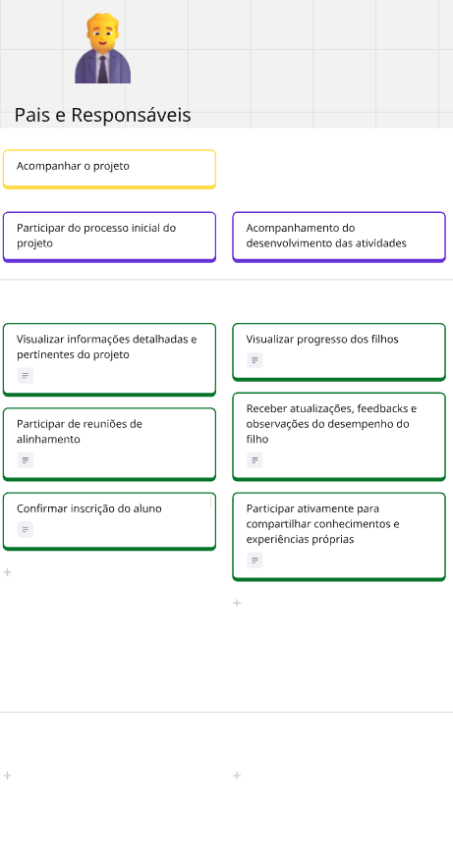

# USM
O User Story Mapping (USM) é uma técnica estratégica de planejamento e comunicação. Ele transforma requisitos abstratos em uma narrativa visual da experiência do usuário. Essa ferramenta garante a visualização do fluxo de atividades e garante que as entregas atendam âs necessidades reais dos usuários. No contexto atual, o USM foi aplicado para estruturar histórias de usuário no projeto do EduConnect.

## Contexto EduConnect

A EduConnect é uma startup fictícia que visa revolucionar a educação por meio de uma plataforma digital projetada para simplificar a criação, o gerenciamento e a avaliação de projetos interdisciplinares e atividades extracurriculares. A ideia principal do projeto é solucionar a fragmentação e a ineficiência nos processos de gestão de projetos educacionais, que atualmente dependem de múltiplas ferramentas desintegradas como planilhas, e-mails e aplicativos de mensagens

A proposta da EduConnect é criar um ecossistema colaborativo para professores, alunos e a comunidade escolar, promovendo uma aprendizagem mais prática e integrada.

### Desafios 

O estudo de caso aponta quatro desafios centrais que a EduConnect pretende superar:

- Fragmentação da Gestão: A plataforma centralizará todas as ferramentas necessárias em um único ambiente, desde o planejamento até a avaliação final.

- Custos Elevados: A empresa oferecerá uma solução financeiramente acessível para instituições de ensino de todos os portes, incluindo escolas públicas e particulares menores, que não podem arcar com os altos custos das soluções existentes.

- Baixo Engajamento dos Alunos: Com uma interface moderna e interativa, a EduConnect busca cativar os estudantes da geração digital, incentivando a participação ativa e a colaboração.

- Falhas na Coordenação: A plataforma facilitará a comunicação e a colaboração eficientes entre todos os stakeholders, incluindo pais e especialistas externos, evitando a perda de informações.

### Soluções
 
A solução da EduConnect foi concebida considerando a colaboração de diferentes personas:

- Para Professores e Coordenadores: A plataforma oferecerá ferramentas robustas para planejamento, definição de escopo, cronograma, alocação de recursos, criação de rubricas de avaliação e acompanhamento do progresso dos alunos.

- Para Alunos: Os estudantes terão acesso a um ambiente intuitivo para receber informações, colaborar em grupos, submeter trabalhos, receber feedbacks e acompanhar seu próprio desenvolvimento.

- Para Pais e Responsáveis: A plataforma permitirá um acompanhamento próximo do progresso dos filhos, com comunicação direta e clara com os professores, além de atualizações regulares sobre as atividades do projeto.

- Para Especialistas Externos: Profissionais convidados terão canais claros para interagir com alunos e professores, compartilhando seus conhecimentos práticos de forma alinhada aos objetivos pedagógicos.

## USM - EduConnect

<iframe width="100%" height="600" src="https://miro.com/app/board/uXjVInurU7Y=/" frameborder="0" scrolling="no" allow="fullscreen; clipboard-read; clipboard-write" allowfullscreen></iframe>

### Persona 01

### Persona 02

### Persona 03

### Persona 04

